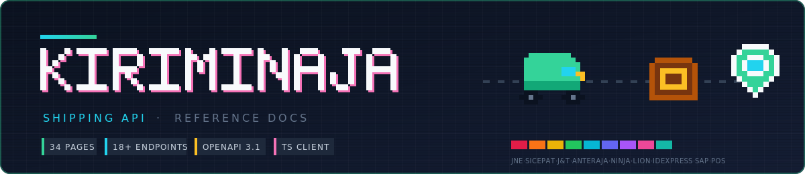
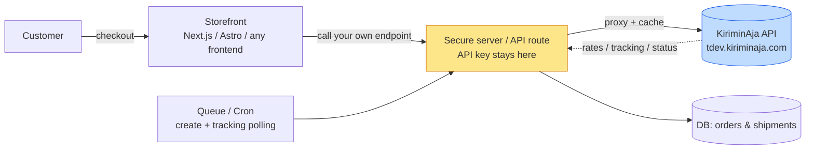
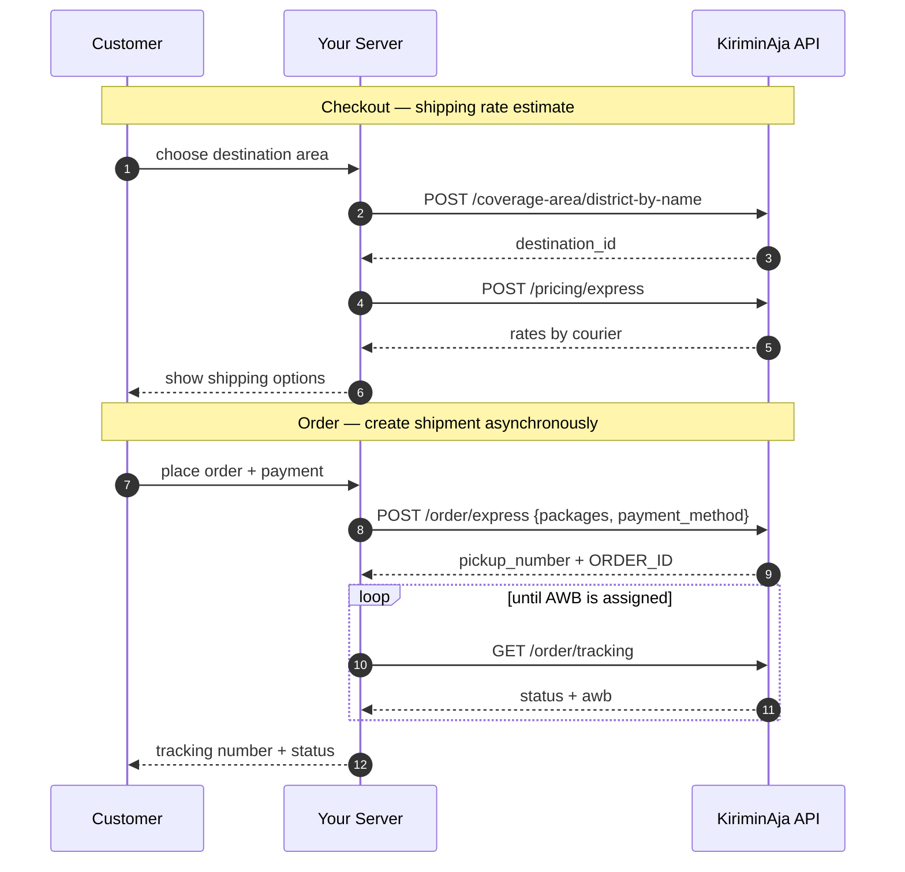

<div align="center">



**Reference documentation and integration patterns for KiriminAja's Indonesia multi-courier shipping API — curated by [ongki.pro](https://ongki.pro).**

Use it with any server-capable stack: **Next.js**, **Astro**, Node, Hono, Laravel, Python, Go, serverless functions, or your own backend.

[](https://ongki.pro)


[](LICENSE)


</div>

---

## What this is

[KiriminAja](https://kiriminaja.com) is an Indonesian logistics aggregator: one API for multi-courier shipping rates, shipment creation, pickup scheduling, and tracking across 15+ couriers.

This repository contains the complete reference documentation scraped from [developer.kiriminaja.com](https://developer.kiriminaja.com) — 34 pages across 10 sections, extracted and formatted for offline reference and integration planning.

> **Verified:** page structure, sidebar navigation, and endpoint categories were captured 2026-07-07 from the live developer portal. Content includes request/response payloads, status code taxonomy, error codes, and environment configuration.

> **API access:** this repository does not provide API keys. To request production/sandbox API access, register at the [Sandbox Dashboard](https://sandbox.kiriminaja.com/).

> **Language note:** this README is written in English for public discoverability. The detailed reference documents may remain in Indonesian where it is more practical for implementation teams.

**Contents:** [Architecture](#architecture) · [Core flow](#core-flow) · [Endpoints](#endpoints-18-reference) · [Repository layout](#repository-layout) · [Documentation index](#documentation-index) · [Quick start](#quick-start) · [Important notes](#important-implementation-notes) · [How this was produced](#how-this-was-produced) · [Changelog](#changelog)

---

## Architecture



**Key principle:** the API key must never reach the browser. All calls go through your server, with GET caching, key redaction in logs, queue/retry for shipment creation, and backoff-based tracking polling.

---

## Core flow



---

## Endpoints (18+ reference)

| Method | Endpoint | Purpose |
| --- | --- | --- |
| POST | `/coverage-area/province` | List provinces |
| POST | `/coverage-area/city` | List cities by province |
| POST | `/coverage-area/district` | List districts by city |
| POST | `/coverage-area/sub-district` | List sub-districts by district |
| POST | `/coverage-area/district-by-name` | Search districts by keyword |
| POST | `/coverage-area/subdistrict-by-name` | Search sub-districts by keyword |
| POST | `/pricing/express` | Express shipping rate quote |
| POST | `/pricing/instant` | Instant (same-day) rate quote |
| POST | `/order/express` | Create express shipment (v6.2, KA Credit) |
| POST | `/order/instant` | Create instant (same-day) shipment |
| GET | `/order/tracking` | Track by order ID |
| GET | `/order/tracking-instant` | Track instant order |
| POST | `/order/void` | Cancel express order |
| POST | `/order/void-instant` | Cancel instant order |
| POST | `/pickup/schedule` | Schedule pickup |
| POST | `/webhook/setup` | Register callback URL |
| — | `/webhook/event` | Webhook payload: express events |
| — | `/webhook/event-instant` | Webhook payload: instant events |
| POST | `/payment` | Get QRIS payment token |
| — | `/payment/ka-credit` | KA Credit balance |
| — | `/payment/pin-validation` | Validate KA Credit PIN |
| — | `/others/courier-list` | List available couriers |
| — | `/others/courier-group` | Courier service groups |
| — | `/others/courier-detail` | Courier service details |

**Auth:** API key passed as Bearer token: `Authorization: Bearer {api_key}`. **Response:** JSON, with a `status: true/false` field. Full reference → [documents/00-INDEX.md](documents/00-INDEX.md).

---

## Where to implement

The API is stack-agnostic. You only need server-side HTTP calls.

| Target | Pattern | Page reference |
| --- | --- | --- |
| **Next.js** App Router / Vercel | Route Handlers / Server Actions | [05-order/express](documents/05-order/01-express.md) + [01-get-started](documents/01-get-started/01-introduction.md) |
| **Astro** + Cloudflare/Node | Server endpoints (`src/pages/api/*`) | Adapt from Next.js pattern; same `fetch`-based approach |
| **Node/Express, Hono, Nest** | Shared `request()` helper | Follow [01-get-started](documents/01-get-started/01-introduction.md) for auth + base URL |
| **PHP / Laravel, Python / FastAPI, Go** | Port the HTTP client; keep key server-side | All [05-order](documents/05-order/) endpoints apply |
| **Serverless** Cloudflare Workers, Vercel, Lambda | Proxy + cache at edge/function layer | GET endpoints cache-friendly (`revalidate: 300`) |
| **Database** Supabase/Postgres/MySQL | Shipments model + status tracking | Status codes → [03-important-notes/status-mapping](documents/03-important-notes/02-status-mapping.md) |
| **Automation** queue/cron | Async order creation + tracking polling | Core flow → architecture diagram above |

Minimum requirements:

1. call KiriminAja only from the server
2. store `destination_id` from `/coverage-area/*` lookup
3. normalise area names
4. create shipments via a job/queue
5. poll tracking status with backoff (webhook as primary if available)

---

## Repository layout

```
.
├── README.md                 ← this file
├── AGENTS.md                 ← contract for AI coding agents (scraping + integration rules)
├── .gitignore
├── .env.example              ← credential template (→ .env)
├── spec/
│   └── openapi.yaml          ← [STUB] OpenAPI 3.1 — will be populated with verified schemas
├── documents/                ← 34 scraped reference pages across 10 sections
│   ├── 00-INDEX.md           ← navigation map + endpoint summary
│   ├── 01-get-started/       ← auth, sandbox/prod environments, rate limiting, SDKs
│   ├── 02-coverage-area/     ← province → city → district → sub-district lookup
│   ├── 03-important-notes/   ← status codes, service list, shipping label format
│   ├── 04-pricing/           ← express & instant rate quoting
│   ├── 05-order/             ← create, track, cancel (express + instant)
│   ├── 06-pickup-delivery/   ← pickup scheduling
│   ├── 07-webhooks/          ← callback registration + event payload schemas
│   ├── 08-payment/           ← QRIS payment, KA Credit, PIN validation
│   ├── 09-utilities/         ← courier list/group/detail, preferences
│   └── 10-deprecated-api/    ← legacy v6.1 + v4 order shapes
├── src/                      ← [COMING] integration examples for Next.js, Astro, Hono
└── scripts/                  ← [COMING] smoke tests, link validation
```

> **Building integrations with this repo (human or AI)?** Read **[AGENTS.md](AGENTS.md)** first — rules for server-only keys, the two different "origin" IDs, `COD_AMOUNT` casing, batch concurrency limits, and async shipment patterns.

---

## Documentation index

| # | Folder | Contents | Key takeaway |
| --- | --- | --- | --- |
| 01 | [get-started](documents/01-get-started/) | Auth, sandbox/prod URLs, rate limiting, SDK availability | Bearer token in `Authorization` header |
| 02 | [coverage-area](documents/02-coverage-area/) | Province → city → district → sub-district lookup + keyword search | 6 endpoints for region resolution |
| 03 | [important-notes](documents/03-important-notes/) | **Status code mapping** (new→transit→attempt→final), 3PL list, shipping label | 50+ granular status codes |
| 04 | [pricing](documents/04-pricing/) | Express rate with origin/destination/weight; instant with lat/long | `courier=all` returns multi-courier rates |
| 05 | [order](documents/05-order/) | Create (v6.2 with KA Credit), insurance/COD, track, cancel | 7 endpoints — core API surface |
| 06 | [pickup-delivery](documents/06-pickup-delivery/) | Pickup schedule management | Single CRUD endpoint |
| 07 | [webhooks](documents/07-webhooks/) | Callback registration, payload schemas (express + instant) | Event payloads: status code, AWB, timestamp |
| 08 | [payment](documents/08-payment/) | QRIS token, KA Credit balance + PIN, COD settlement | 3 payment flows |
| 09 | [utilities](documents/09-utilities/) | Courier list, service groups, detail, whitelist preferences | 5 lookup endpoints |
| 10 | [deprecated-api](documents/10-deprecated-api/) | Legacy create order (v6.1 express, v4 instant) | Compatibility awareness |

Recommended reading order: `01 → 03 → 04 → 05`, then explore based on your integration needs.

---

## Quick start

```bash
# 1. Get your API key
# Register at https://sandbox.kiriminaja.com/ → wait for approval → copy key from Integrasi

# 2. Test a shipping estimate (sandbox)
curl -sS -X POST "https://tdev.kiriminaja.com/api/public/{YOUR_KEY}/coverage-area/province" \
  -H "Authorization: Bearer {YOUR_KEY}" \
  -H "Accept: application/json" \
  -H "Content-Type: application/json" \
  -d '{}' | jq .

# 3. Explore the reference docs
# Start with documents/01-get-started/01-introduction.md
# Then read documents/03-important-notes/02-status-mapping.md
# Then documents/05-order/01-express.md for the main order creation flow
```

---

## Important implementation notes

Patterns observed from the reference — critical for integration:

- **Two different "origin" IDs**: rate quoting uses an area `_id` from location search; pickup scheduling uses a separate pickup-address `_id`. These must not be mixed up.
- **Async AWB assignment**: `POST /order/express` returns immediately with a `pickup_number`. The actual tracking number (`awb`) arrives later via webhook. Poll `/order/tracking` with backoff as fallback.
- **Granular status codes**: 50+ codes across Entry (100–105), Shipment (106–905), and Final (200–704). Don't just check "delivered" — handle transit, attempt, return, and problem states.
- **COD + non-COD flows differ**: COD orders use the `cod` field in the package object; non-COD can use VA or KA Credit (`payment_method: "credit"`). COD and KA Credit are mutually exclusive.
- **Per-courier requirements**: some couriers need lat/long (Lion, Pos Indonesia); some need sub-district (`kelurahan_id`). Validate per courier before sending.
- **Batch concurrency**: certain couriers enforce one-batch-per-account — parallel batches return `409 Conflict`.
- **Date format**: pickup schedules use `YYYY-MM-DD HH:mm:ss` (ISO-like with space separator, not `T`).
- **Rate limiting**: sandbox returns `429 Too Many Requests` when exceeded. Production limits are negotiated.

---

## How this was produced

| Step | Tool | Detail |
|---|---|---|
| URL discovery | Browser sidebar crawl | 34 unique page slugs from `developer.kiriminaja.com` navigation |
| HTML render | Playwright-core + Chrome headless | 4 parallel contexts, 25–35s per page, network idle + scroll trigger |
| Markdown conversion | Custom Node.js script | Body content extraction, nav/aside/footer stripping, heading/tables/code preservation |
| Post-processing | Cleanup script | Source URL fix, garbled line removal, heading dedup, footer nav strip |

> The developer portal is Nuxt SPA (client-side hydrated). Plain `curl`/`fetch` returns empty HTML shells — headless browser rendering was required.

To regenerate after upstream docs change:

```bash
# Update /tmp/kirimin-urls.txt with new slugs, then:
node /tmp/scrape-final.cjs    # renders all pages to HTML (parallel, 4 contexts)
node /tmp/extract-md-v2.cjs   # converts HTML → Markdown
node /tmp/clean-md.cjs        # post-process: URLs, garbage, dedup
```

Requires: `playwright-core` + system Google Chrome.

---

## Changelog

| Date | Change |
| --- | --- |
| 2026-07-07 | **Scrape complete:** 34 pages across 10 sections. Extracted, cleaned, indexed. |
| 2026-07-07 | **Workspace initialised:** README, AGENTS.md, .gitignore, .env.example, spec/openapi.yaml stub, LICENSE. |

---

## Disclaimer

This repository is **community-curated reference documentation** and is **not affiliated with, endorsed by, or officially connected to KiriminAja or PT Selalu Siap Solusi.**

- All KiriminAja trademarks, logos, and brand names are property of their respective owners.
- The content was scraped from the publicly accessible [developer.kiriminaja.com](https://developer.kiriminaja.com) for educational and integration-planning purposes.
- For official documentation, always refer to [developer.kiriminaja.com](https://developer.kiriminaja.com).
- No API keys, credentials, or private data were scraped or stored.

---

## Related Repositories

| Repository | Description |
| --- | --- |
| [kiriminaja/php](https://github.com/kiriminaja/php) | Official PHP SDK — Composer package |
| [kiriminaja/node](https://github.com/kiriminaja/node) | Official Node.js SDK — npm package (`kiriminaja`) |
| [kiriminaja/go](https://github.com/kiriminaja/go) | Official Go SDK — zero external dependencies |
| [kiriminaja/python](https://github.com/kiriminaja/python) | Official Python SDK |
| [kiriminaja/ruby](https://github.com/kiriminaja/ruby) | Official Ruby SDK |
| [kiriminaja/rust](https://github.com/kiriminaja/rust) | Official Rust SDK |
| [kiriminaja/docs](https://github.com/kiriminaja/docs) | Official docs source (Nuxt Content) |
| [kiriminaja/wordpress](https://github.com/kiriminaja/wordpress) | Official WooCommerce plugin |
| [ongkipro/mengantar-documentation](https://github.com/ongkipro/mengantar-documentation) | Similar reference docs for Mengantar API (sister repo) |

---

## Contributing

This is a reference-only repository. The scraped documents in `documents/` are not intended for manual editing.

- **Corrections:** if you find factual errors, [open an issue](https://github.com/ongkipro/kiriminaja-documentation/issues).
- **Upstream changes:** the scrape process can be re-run when KiriminAja updates their developer portal. See [How this was produced](#how-this-was-produced).
- **Pull requests:** welcome for README improvements, tooling, and integration examples (when `src/` is added).

---

## Security

- No API keys, credentials, or authentication tokens are stored in this repository.
- The `.env.example` file is a template only — never commit a real `.env` file.
- If you discover a security issue with the scraping process, please [open an issue](https://github.com/ongkipro/kiriminaja-documentation/issues) rather than a public discussion.

---

## About

This reference documentation is curated by **[ongki.pro](https://ongki.pro)**.

We build tools for Indonesian commerce — shipping integration, storefronts, payments, and automation — with a terminal-first engineering philosophy.

**Governance:** [AGENTS.md](AGENTS.md) · [LICENSE](LICENSE)

<div align="center">

**[ongki.pro](https://ongki.pro)** · Building Digital Growth Systems

</div>
